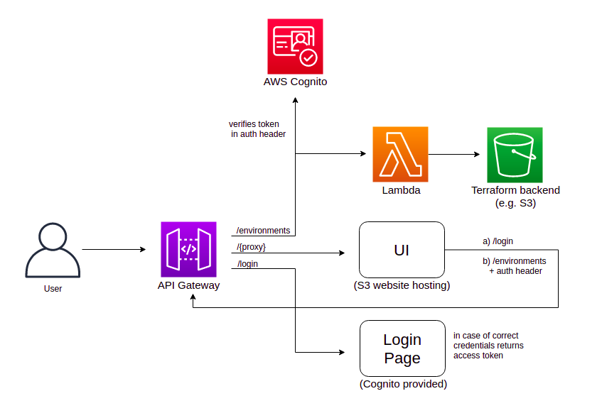

# Tf-management


### About the project

This tool is made to simplify process of terraform stacks monitoring 
(and management in the future). 

User can easily monitor which stacks under which environment in which region 
are deployed at the moment. Terraform variables and deployment history are 
also available (if provided).    


## Architecture



### Project components

- **backend** - backend (lambda function) sources and tests

- **environment** - contains:
    * CloudFormation template for backend deployment,
    * deployment scripts

- **frontend** - frontend sources

- **utils** - util scripts that may be used (in case of s3 tf backend now only):  
    * to simplify terraform initialization 
    * to construct terraform backend key  
    * to support stack history updates
    
    _(Note: util scripts may be adjusted as needed)_


 
### Backend storage assumptions

1. Tfstate files are stored along with tfvars files and metadata files

2. Tfstate, tfvars, metadata files are stored with the following key format:
```{base_path}/{env_id}/{region}/{stackname}.{tfstate|tfvars|meta}```  
_(Note: base_path might be set to abbreviation of your project/subproject name)_

3. Metadata is a **json** file that stores history of deployments in the 
   following format (metadata of the latest deployment is inserted into the
   beginning of the list):
```json
{
  "history": [
    {
      "git_branch_name": string,
      "commit_msg": string,
      "build_url": string,
      "update_ts": number
    }, ...
 ]
}
``` 


### Deployment

1. Download and unzip release artifacts with the following structure:
    - **backend.zip** - backend source code archive
    - **dist** - frontend distribution
    - **cloudformation** - cfn templates
    - **utils** - util scripts
    - **deploy-tf-management.sh** - script to deploy tf-management
    - **cleanup-tf-management.sh** - destroy and cleanup tf-management

2. Deploy tf-management:

    - Configure deployment by creating config file (see **Configuration** section)
    - Make sure AWS_DEFAULT_REGION, AWS_PROFILE env variables are set
    - Run the following command:
        ```
        ./deploy-tf-management.sh "{path_to_cfn_config_path}"
        ```

3. Configure terraform stacks deployment:  
    Note: release artifacts contain util scripts (see **Util scripts** section)
    
    - Make sure all tf stacks have the following backend configuration:
    ```hcl-terraform
    # backend.tf file
    terraform {
        backend "s3" {}
    }
    ```
    - Before initializing stack construct tfstate, tfvars, metadata S3 keys using util script:
    ```
    # bash example
    
    tfstate_key = . {path_to_utils}/s3/construct-key.sh base_path region env_id stack_name.tfstate 
    tfsvars_key = . {path_to_utils}/s3/construct-key.sh base_path region env_id stack_name.tfvars
    metadata_key = . {path_to_utils}/s3/construct-key.sh base_path region env_id stack_name.meta
    ```
    - Create tfvars file
    - Initialize terraform:  
    ```
    # within tf directory, using constructed tfstate_key
    . {path_to_utils}/s3/tf-init.sh tfstate_bucket tfstate_key tfstate_s3_region dynamodb_table
    ```   
    - Plan terraform changes
    - Apply tf changes
    - Download and update metadata file (metadata_file_path param is a file to save metadata to):
    ```
    . {path_to_utils}/s3/metadata-upload.sh tfstate_bucket metadata_key metadata_file_path current_build_url
    ```
    - Upload tfvars, metadata files to tfstate bucket by constructed keys:
        ```
        . {path_to_utils}/s3/metadata-and-tfvars-upload.sh tfstate_bucket tfvars_file tfvars_key metadata_file metadata_key
        ```


### Configuration

In order to configure CloudFormation stack with tf-management backend resources
create **cfn.config.json** file.  
It should contain the following variables (see descriptions in 
_environment/cloudformation/tf-management.template_):   

- Required (no default values):
    - **ArtifactsS3BucketName** - S3 bucket with tf management lambda sources
    - **ArtifactsS3TfManagementLambdaKey** - S3 bucket key for tf management lambda sources archive
    - **UserEmailAddress** - User email address, a user with email address name will be 
      created, password will be send to the specified email address as well
    - **CertificateArn** - Certificate ARN used to create API Gateway domain name
    - **HostedZoneDomainName** - Hosted zone domain name
    - **DomainName** - Common domain name for API Gateway and UI S3 bucket.
      Will be concatenated with HostedZoneDomainName.
    - **UniqueString** - A string added to all resources that must be unique across all stacks

- Optional:
    - **TfBackendType** - defaults to 'S3'. Terraform backend where .tfstate files are stored
    - **TfstateS3BucketName** - defaults to 'NONE'. Terraform backend S3 bucket name
        Note: required if 'TfBackendType' is set to 'S3'
    - **TfstateS3BaseLocation** - defaults to ''. Terraform backend S3 bucket base location. E.g. 'system/'.
      Value of '', meaning all keys are scanned
    - **TfstateKeyDelimiter** - defaults to '/'. Terraform backend key delimiter. For example S3 bucket keys
      are stored like 'dir1/dir2/.../object_name'
    - **MemorySize** - defaults to 1024. Tf management lambda function memory size (1024 preferrable)
    - **LambdaLogLevel** - defaults to 'INFO'. Tf management lambda function log level
    - **CloudProviderType** - defaults to 'AWS'. Cloud provider where deployed resources are located.
      Reqiured to provide resource URLs
    - **Stage** - defaults to 'v1'. API Gateway deployment stage name
              
#### Example:
```json
{
  "ArtifactsS3BucketName": "tf-management-artifacts",
  "ArtifactsS3TfManagementLambdaKey": "backend.zip",
  "TfstateS3BucketName": "tf-management-tests",
  "UserEmailAddress": "example@email",
  "CertificateArn": "arn:aws:acm:{region}:{account}:certificate/{id}",
  "HostedZoneDomainName": "domain.name",
  "DomainName": "tf-management",
  "UniqueString": "abc123"
}
```

### Util scripts

Directory: _utils/s3_  
Scripts:  

- **construct-key.sh** - constructs key for backend storage with the following format:
```$base_path/$region/$env_id/$filename``` 

- **metadata-update.sh** - downloads metadata file from s3 backend bucket and 
updates metadata file with current build data

- **metadata-and-tfvars-upload.sh** - uploads to tfvars and metadata files tfstate S3 bucket  

- **tf-init.sh** - initializes specified terraform directory